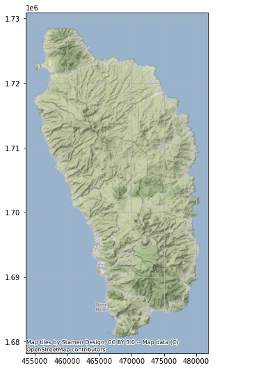
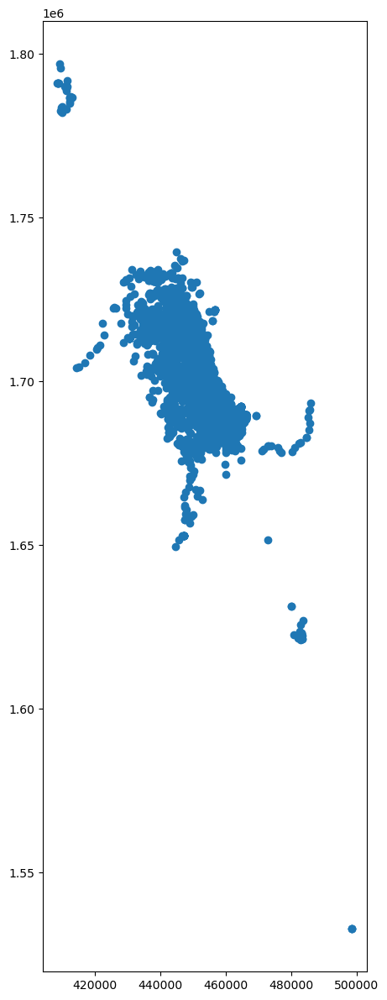
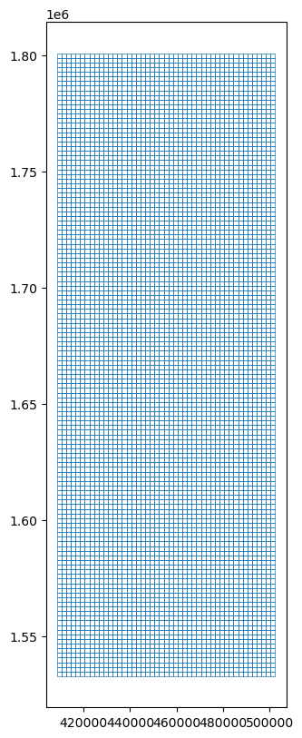
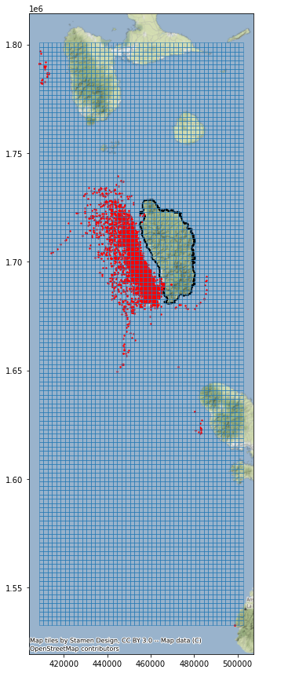
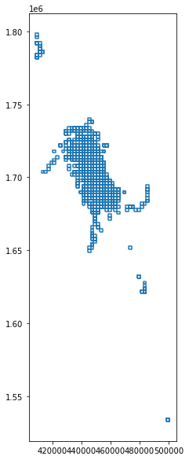
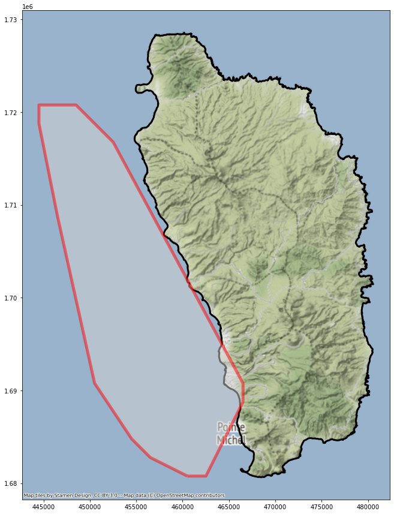
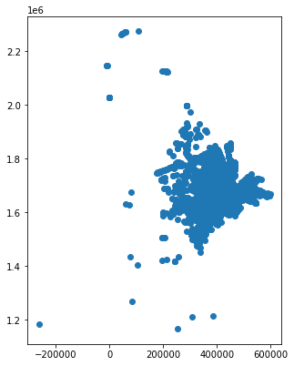
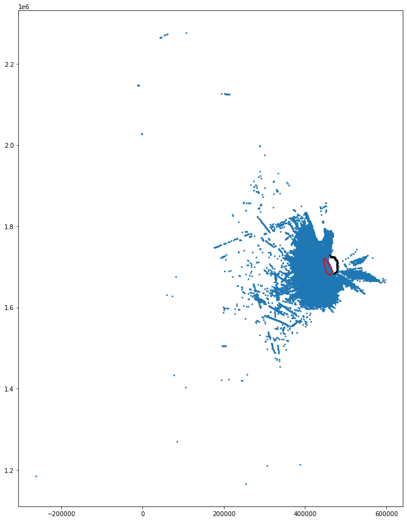
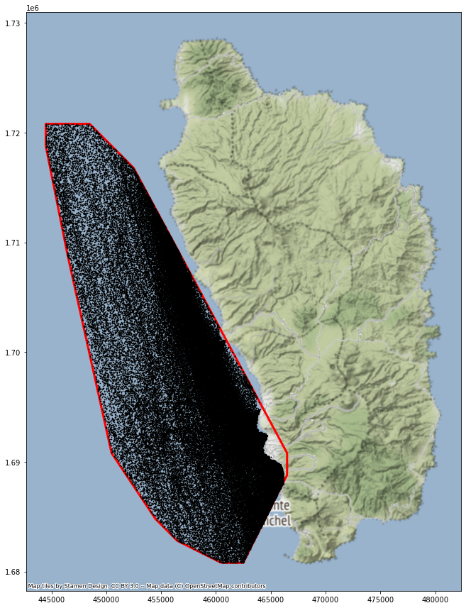

```{r setup, include=FALSE}
knitr::opts_chunk$set(echo = FALSE)
```

This analysis identifies a speed reduction zone off the island of Dominica for the purpose of reducing the occurrence of ships striking whales and quantifies the impact of reduced travel speeds on marine traffic.

## Contents
[Setup](#setup)  
[Dominica outline](#dominica)  
[Plot the Dominica outline](#plot_dominica)  
[Whale sighting data](#whale)  
[Create grid](#grid)  
[Extract whale habitat](#habitat)  
[Vessel data](#vessel)  
[Calculate speed and distance](#speed)

## Setup
<a class="anchor" id="setup"></a>

```python
import pandas as pd
import geopandas as gpd
import os
import matplotlib.pyplot as plt
import numpy as np
import shapely
import contextily as ctx
```

## Dominica outline
<a class="anchor" id="dominica"></a>

```python
# Define path to folder
input_folder = r"data/dominica"

# Join folder path and filename 
fp = os.path.join(input_folder, "dma_admn_adm0_py_s1_dominode_v2.shp")

# Print out the full file path
print(fp)
```

    data/dominica/dma_admn_adm0_py_s1_dominode_v2.shp


```python
# Read file using gpd.read_file()
dominica = gpd.read_file(fp)
```


```python
type(dominica)
```


    geopandas.geodataframe.GeoDataFrame


```python
dominica.head()
```


<div>
<style scoped>
    .dataframe tbody tr th:only-of-type {
        vertical-align: middle;
    }

    .dataframe tbody tr th {
        vertical-align: top;
    }

    .dataframe thead th {
        text-align: right;
    }
</style>
<table border="1" class="dataframe">
  <thead>
    <tr style="text-align: right;">
      <th></th>
      <th>ADM0_PCODE</th>
      <th>ADM0_EN</th>
      <th>geometry</th>
    </tr>
  </thead>
  <tbody>
    <tr>
      <th>0</th>
      <td>DM</td>
      <td>Dominica</td>
      <td>POLYGON ((-61.43023 15.63952, -61.43019 15.639...</td>
    </tr>
  </tbody>
</table>
</div>


```python
dominica.crs
```


    <Geographic 2D CRS: EPSG:4326>
    Name: WGS 84
    Axis Info [ellipsoidal]:
    - Lat[north]: Geodetic latitude (degree)
    - Lon[east]: Geodetic longitude (degree)
    Area of Use:
    - name: World.
    - bounds: (-180.0, -90.0, 180.0, 90.0)
    Datum: World Geodetic System 1984 ensemble
    - Ellipsoid: WGS 84
    - Prime Meridian: Greenwich


```python
# change the projection to Dominica 1945 / British West Indies Grid (metric units)
proj_area_crs = 2002 # project area coordinate system EPSG code. Projected CRS for Dominica is 2002
dominica = dominica.to_crs(epsg=proj_area_crs)
```


```python
dominica.crs
```


    <Projected CRS: EPSG:2002>
    Name: Dominica 1945 / British West Indies Grid
    Axis Info [cartesian]:
    - E[east]: Easting (metre)
    - N[north]: Northing (metre)
    Area of Use:
    - name: Dominica - onshore.
    - bounds: (-61.55, 15.14, -61.2, 15.69)
    Coordinate Operation:
    - name: British West Indies Grid
    - method: Transverse Mercator
    Datum: Dominica 1945
    - Ellipsoid: Clarke 1880 (RGS)
    - Prime Meridian: Greenwich


## Plot the Dominica outline
<a class="anchor" id="plot_dominica"></a>

```python
ax = dominica.plot(color="none", figsize=(9, 9))
ctx.add_basemap(ax, crs=dominica.crs.to_string())
ax.grid(True)
```


    

    


## Whale sighting data 
<a class="anchor" id="whale"></a>
Whale habitat was approximated using data from approximately 5,000 whale sightings between 2008 and 2015.


```python
# Define path to folder
input_folder2 = r"data"

# Join folder path and filename 
fp2 = os.path.join(input_folder2, "sightings2005_2018.csv")

# Print out the full file path
print(fp2)
```

    data/sightings2005_2018.csv


```python
# Read file using gpd.read_file()
whales = gpd.read_file(fp2)
```


```python
type(whales)
```


    geopandas.geodataframe.GeoDataFrame


```python
whales.head()
```


<div>
<style scoped>
    .dataframe tbody tr th:only-of-type {
        vertical-align: middle;
    }

    .dataframe tbody tr th {
        vertical-align: top;
    }

    .dataframe thead th {
        text-align: right;
    }
</style>
<table border="1" class="dataframe">
  <thead>
    <tr style="text-align: right;">
      <th></th>
      <th>field_1</th>
      <th>GPStime</th>
      <th>Lat</th>
      <th>Long</th>
      <th>geometry</th>
    </tr>
  </thead>
  <tbody>
    <tr>
      <th>0</th>
      <td>0</td>
      <td>2005-01-15 07:43:27</td>
      <td>15.36977117</td>
      <td>-61.49328433</td>
      <td>None</td>
    </tr>
    <tr>
      <th>1</th>
      <td>1</td>
      <td>2005-01-15 08:07:13</td>
      <td>15.3834075</td>
      <td>-61.503702</td>
      <td>None</td>
    </tr>
    <tr>
      <th>2</th>
      <td>2</td>
      <td>2005-01-15 08:31:17</td>
      <td>15.38106333</td>
      <td>-61.50486067</td>
      <td>None</td>
    </tr>
    <tr>
      <th>3</th>
      <td>3</td>
      <td>2005-01-15 09:19:10</td>
      <td>15.33532083</td>
      <td>-61.46858117</td>
      <td>None</td>
    </tr>
    <tr>
      <th>4</th>
      <td>4</td>
      <td>2005-01-15 10:08:00</td>
      <td>15.294224</td>
      <td>-61.45318517</td>
      <td>None</td>
    </tr>
  </tbody>
</table>
</div>


```python
# bootstrap the geometries
whale_points = gpd.points_from_xy(whales['Long'], whales['Lat'])
whale_gdf = gpd.GeoDataFrame(whales, geometry=whale_points)
```


```python
whale_gdf.head()
```


<div>
<style scoped>
    .dataframe tbody tr th:only-of-type {
        vertical-align: middle;
    }

    .dataframe tbody tr th {
        vertical-align: top;
    }

    .dataframe thead th {
        text-align: right;
    }
</style>
<table border="1" class="dataframe">
  <thead>
    <tr style="text-align: right;">
      <th></th>
      <th>field_1</th>
      <th>GPStime</th>
      <th>Lat</th>
      <th>Long</th>
      <th>geometry</th>
    </tr>
  </thead>
  <tbody>
    <tr>
      <th>0</th>
      <td>0</td>
      <td>2005-01-15 07:43:27</td>
      <td>15.36977117</td>
      <td>-61.49328433</td>
      <td>POINT (-61.49328 15.36977)</td>
    </tr>
    <tr>
      <th>1</th>
      <td>1</td>
      <td>2005-01-15 08:07:13</td>
      <td>15.3834075</td>
      <td>-61.503702</td>
      <td>POINT (-61.50370 15.38341)</td>
    </tr>
    <tr>
      <th>2</th>
      <td>2</td>
      <td>2005-01-15 08:31:17</td>
      <td>15.38106333</td>
      <td>-61.50486067</td>
      <td>POINT (-61.50486 15.38106)</td>
    </tr>
    <tr>
      <th>3</th>
      <td>3</td>
      <td>2005-01-15 09:19:10</td>
      <td>15.33532083</td>
      <td>-61.46858117</td>
      <td>POINT (-61.46858 15.33532)</td>
    </tr>
    <tr>
      <th>4</th>
      <td>4</td>
      <td>2005-01-15 10:08:00</td>
      <td>15.294224</td>
      <td>-61.45318517</td>
      <td>POINT (-61.45319 15.29422)</td>
    </tr>
  </tbody>
</table>
</div>


```python
type(whale_gdf)
```


    geopandas.geodataframe.GeoDataFrame


```python
# project the dataset into an appropriate CRS
whale_gdf = whale_gdf.set_crs(epsg=4326)
whale_gdf = whale_gdf.to_crs(epsg=proj_area_crs)
```


```python
whale_gdf.crs
```


    <Projected CRS: EPSG:2002>
    Name: Dominica 1945 / British West Indies Grid
    Axis Info [cartesian]:
    - E[east]: Easting (metre)
    - N[north]: Northing (metre)
    Area of Use:
    - name: Dominica - onshore.
    - bounds: (-61.55, 15.14, -61.2, 15.69)
    Coordinate Operation:
    - name: British West Indies Grid
    - method: Transverse Mercator
    Datum: Dominica 1945
    - Ellipsoid: Clarke 1880 (RGS)
    - Prime Meridian: Greenwich


```python
fig, ax = plt.subplots(figsize=(15,15), dpi=100)

whale_gdf.plot(ax=ax)
```


    <AxesSubplot:>


    

    


## Create grid
<a class="anchor" id="grid"></a>

```python
xmin, ymin, xmax, ymax = whale_gdf.total_bounds

cell_size = 2000
length = 2000
width = 2000

xs = list(np.arange(xmin, xmax + width, width)) # return evenly spaced values starting at xmin, stopping (but not including) at xmax+width, by a step of width
ys = list(np.arange(ymin, ymax + length, length))
```


```python
xmin, ymin, xmax, ymax
```


    (408480.65208368783, 1532792.7459409237, 498500.3049570159, 1796964.3997029224)


```python
# function to convert corner points into a cell polygon
def make_cell(x, y, cell_size):
    ring = [
        (x, y),
        (x + cell_size, y),
        (x + cell_size, y + cell_size),
        (x, y + cell_size)
    ]
    cell = shapely.geometry.Polygon(ring)
    return cell
```


```python
# iterate over each combination of x and y coordinates in two nested for loops
cells = []
for x in xs:
    for y in ys:
        cell = make_cell(x, y, cell_size)
        cells.append(cell)
```


```python
grid = gpd.GeoDataFrame({'geometry':cells}, crs=proj_area_crs)
#grid.to_file("grid.shp")
```


```python
grid.head()
```


<div>
<style scoped>
    .dataframe tbody tr th:only-of-type {
        vertical-align: middle;
    }

    .dataframe tbody tr th {
        vertical-align: top;
    }

    .dataframe thead th {
        text-align: right;
    }
</style>
<table border="1" class="dataframe">
  <thead>
    <tr style="text-align: right;">
      <th></th>
      <th>geometry</th>
    </tr>
  </thead>
  <tbody>
    <tr>
      <th>0</th>
      <td>POLYGON ((408480.652 1532792.746, 410480.652 1...</td>
    </tr>
    <tr>
      <th>1</th>
      <td>POLYGON ((408480.652 1534792.746, 410480.652 1...</td>
    </tr>
    <tr>
      <th>2</th>
      <td>POLYGON ((408480.652 1536792.746, 410480.652 1...</td>
    </tr>
    <tr>
      <th>3</th>
      <td>POLYGON ((408480.652 1538792.746, 410480.652 1...</td>
    </tr>
    <tr>
      <th>4</th>
      <td>POLYGON ((408480.652 1540792.746, 410480.652 1...</td>
    </tr>
  </tbody>
</table>
</div>


```python
grid.crs
```


    <Projected CRS: EPSG:2002>
    Name: Dominica 1945 / British West Indies Grid
    Axis Info [cartesian]:
    - E[east]: Easting (metre)
    - N[north]: Northing (metre)
    Area of Use:
    - name: Dominica - onshore.
    - bounds: (-61.55, 15.14, -61.2, 15.69)
    Coordinate Operation:
    - name: British West Indies Grid
    - method: Transverse Mercator
    Datum: Dominica 1945
    - Ellipsoid: Clarke 1880 (RGS)
    - Prime Meridian: Greenwich


```python
fig, ax = plt.subplots(figsize=(10,10), dpi=100)

grid.boundary.plot(ax=ax, linewidth = 0.5)
```


    <AxesSubplot:>


    

    


```python
base = dominica.plot(facecolor='none', edgecolor='black', linewidth=2, figsize=(15, 15))
whale_gdf.plot(ax=base, facecolor='red', markersize=2)
grid.boundary.plot(ax=base, linewidth = 0.5)
ctx.add_basemap(ax=base, crs=dominica.crs.to_string())
```


    

    


## Extract whale habitat
<a class="anchor" id="habitat"></a>

```python
# spatially join the grid with whale sighting data to count the number of sightings in each cell
# use an inner join since we're not interested in grid cells without any sightings
whale_grid = grid.sjoin(whale_gdf, how="inner")
whale_grid
```


<div>
<style scoped>
    .dataframe tbody tr th:only-of-type {
        vertical-align: middle;
    }

    .dataframe tbody tr th {
        vertical-align: top;
    }

    .dataframe thead th {
        text-align: right;
    }
</style>
<table border="1" class="dataframe">
  <thead>
    <tr style="text-align: right;">
      <th></th>
      <th>geometry</th>
      <th>index_right</th>
      <th>field_1</th>
      <th>GPStime</th>
      <th>Lat</th>
      <th>Long</th>
    </tr>
  </thead>
  <tbody>
    <tr>
      <th>124</th>
      <td>POLYGON ((408480.652 1780792.746, 410480.652 1...</td>
      <td>4327</td>
      <td>4327</td>
      <td>2018-03-15 06:41:03</td>
      <td>16.127</td>
      <td>-61.896866</td>
    </tr>
    <tr>
      <th>124</th>
      <td>POLYGON ((408480.652 1780792.746, 410480.652 1...</td>
      <td>4328</td>
      <td>4328</td>
      <td>2018-03-15 06:44:05</td>
      <td>16.127666</td>
      <td>-61.900766</td>
    </tr>
    <tr>
      <th>124</th>
      <td>POLYGON ((408480.652 1780792.746, 410480.652 1...</td>
      <td>4329</td>
      <td>4329</td>
      <td>2018-03-15 06:58:17</td>
      <td>16.1305</td>
      <td>-61.903366</td>
    </tr>
    <tr>
      <th>125</th>
      <td>POLYGON ((408480.652 1782792.746, 410480.652 1...</td>
      <td>4330</td>
      <td>4330</td>
      <td>2018-03-15 07:15:33</td>
      <td>16.139583</td>
      <td>-61.900116</td>
    </tr>
    <tr>
      <th>125</th>
      <td>POLYGON ((408480.652 1782792.746, 410480.652 1...</td>
      <td>4331</td>
      <td>4331</td>
      <td>2018-03-15 07:17:30</td>
      <td>16.14175</td>
      <td>-61.897716</td>
    </tr>
    <tr>
      <th>...</th>
      <td>...</td>
      <td>...</td>
      <td>...</td>
      <td>...</td>
      <td>...</td>
      <td>...</td>
    </tr>
    <tr>
      <th>5171</th>
      <td>POLYGON ((484480.652 1690792.746, 486480.652 1...</td>
      <td>1147</td>
      <td>1147</td>
      <td>2008-05-04 16:59:36</td>
      <td>15.304085</td>
      <td>-61.194134</td>
    </tr>
    <tr>
      <th>5172</th>
      <td>POLYGON ((484480.652 1692792.746, 486480.652 1...</td>
      <td>1148</td>
      <td>1148</td>
      <td>2008-05-04 17:43:45</td>
      <td>15.321439</td>
      <td>-61.19188</td>
    </tr>
    <tr>
      <th>6030</th>
      <td>POLYGON ((498480.652 1532792.746, 500480.652 1...</td>
      <td>609</td>
      <td>609</td>
      <td>2005-03-20 11:50:05</td>
      <td>13.86967067</td>
      <td>-61.0794355</td>
    </tr>
    <tr>
      <th>6030</th>
      <td>POLYGON ((498480.652 1532792.746, 500480.652 1...</td>
      <td>611</td>
      <td>611</td>
      <td>2005-03-20 12:56:58</td>
      <td>13.86967067</td>
      <td>-61.0794355</td>
    </tr>
    <tr>
      <th>6030</th>
      <td>POLYGON ((498480.652 1532792.746, 500480.652 1...</td>
      <td>610</td>
      <td>610</td>
      <td>2005-03-20 12:05:10</td>
      <td>13.86967067</td>
      <td>-61.0794355</td>
    </tr>
  </tbody>
</table>
<p>4893 rows × 6 columns</p>
</div>


```python
whale_grid.boundary.plot(figsize=(5,10))
```


    <AxesSubplot:>


    

    


```python
whale_grid.crs
```


    <Projected CRS: EPSG:2002>
    Name: Dominica 1945 / British West Indies Grid
    Axis Info [cartesian]:
    - E[east]: Easting (metre)
    - N[north]: Northing (metre)
    Area of Use:
    - name: Dominica - onshore.
    - bounds: (-61.55, 15.14, -61.2, 15.69)
    Coordinate Operation:
    - name: British West Indies Grid
    - method: Transverse Mercator
    Datum: Dominica 1945
    - Ellipsoid: Clarke 1880 (RGS)
    - Prime Meridian: Greenwich


```python
grid['count'] = whale_grid.groupby(whale_grid.index).count()['index_right']
grid
```


<div>
<style scoped>
    .dataframe tbody tr th:only-of-type {
        vertical-align: middle;
    }

    .dataframe tbody tr th {
        vertical-align: top;
    }

    .dataframe thead th {
        text-align: right;
    }
</style>
<table border="1" class="dataframe">
  <thead>
    <tr style="text-align: right;">
      <th></th>
      <th>geometry</th>
      <th>count</th>
    </tr>
  </thead>
  <tbody>
    <tr>
      <th>0</th>
      <td>POLYGON ((408480.652 1532792.746, 410480.652 1...</td>
      <td>NaN</td>
    </tr>
    <tr>
      <th>1</th>
      <td>POLYGON ((408480.652 1534792.746, 410480.652 1...</td>
      <td>NaN</td>
    </tr>
    <tr>
      <th>2</th>
      <td>POLYGON ((408480.652 1536792.746, 410480.652 1...</td>
      <td>NaN</td>
    </tr>
    <tr>
      <th>3</th>
      <td>POLYGON ((408480.652 1538792.746, 410480.652 1...</td>
      <td>NaN</td>
    </tr>
    <tr>
      <th>4</th>
      <td>POLYGON ((408480.652 1540792.746, 410480.652 1...</td>
      <td>NaN</td>
    </tr>
    <tr>
      <th>...</th>
      <td>...</td>
      <td>...</td>
    </tr>
    <tr>
      <th>6293</th>
      <td>POLYGON ((500480.652 1790792.746, 502480.652 1...</td>
      <td>NaN</td>
    </tr>
    <tr>
      <th>6294</th>
      <td>POLYGON ((500480.652 1792792.746, 502480.652 1...</td>
      <td>NaN</td>
    </tr>
    <tr>
      <th>6295</th>
      <td>POLYGON ((500480.652 1794792.746, 502480.652 1...</td>
      <td>NaN</td>
    </tr>
    <tr>
      <th>6296</th>
      <td>POLYGON ((500480.652 1796792.746, 502480.652 1...</td>
      <td>NaN</td>
    </tr>
    <tr>
      <th>6297</th>
      <td>POLYGON ((500480.652 1798792.746, 502480.652 1...</td>
      <td>NaN</td>
    </tr>
  </tbody>
</table>
<p>6298 rows × 2 columns</p>
</div>


```python
# subset the grid dataframe to cells that have more than 20 sightings
whale_mask = (grid['count'] > 20)
whale_mask
```


    0       False
    1       False
    2       False
    3       False
    4       False
            ...  
    6293    False
    6294    False
    6295    False
    6296    False
    6297    False
    Name: count, Length: 6298, dtype: bool


```python
whale_habitat = grid[whale_mask]
```


```python
speed_reduction_zone = whale_habitat.unary_union.convex_hull
speed_reduction_zone
```


    

    


```python
type(speed_reduction_zone)
# need to create a new GeoDataFrame with the speed_reduction_zone as a single feature
```


    shapely.geometry.polygon.Polygon


```python
speed_reduction_zone = gpd.GeoDataFrame(index=[0], crs='epsg:2002', geometry=[speed_reduction_zone])
```


```python
speed_reduction_zone.crs
```


    <Projected CRS: EPSG:2002>
    Name: Dominica 1945 / British West Indies Grid
    Axis Info [cartesian]:
    - E[east]: Easting (metre)
    - N[north]: Northing (metre)
    Area of Use:
    - name: Dominica - onshore.
    - bounds: (-61.55, 15.14, -61.2, 15.69)
    Coordinate Operation:
    - name: British West Indies Grid
    - method: Transverse Mercator
    Datum: Dominica 1945
    - Ellipsoid: Clarke 1880 (RGS)
    - Prime Meridian: Greenwich


```python
type(speed_reduction_zone)
```


    geopandas.geodataframe.GeoDataFrame


```python
base = dominica.plot(facecolor='none', edgecolor='black', linewidth=3, figsize=(15, 15))
speed_reduction_zone.plot(ax=base, facecolor='lightgray', edgecolor='red', alpha=0.5, linewidth=5)
ctx.add_basemap(ax=base, crs=dominica.crs.to_string())
```


    

    


## Vessel data
<a class="anchor" id="vessel"></a>
Vessel data was obtained from Automatic Identification System (AIS) tranceivers from 2015.

### Load data


```python
# Join folder path and filename 
fp3 = os.path.join(input_folder2, "station1249.csv")

# Print out the full file path
print(fp3)
```

    data/station1249.csv


```python
# Read file using gpd.read_file()
vessels = gpd.read_file(fp3)
```


```python
type(vessels)
```


    geopandas.geodataframe.GeoDataFrame


```python
vessels.head
```


    <bound method NDFrame.head of        field_1       MMSI        LON       LAT            TIMESTAMP geometry
    0            0  233092000  -61.84788  15.23238  2015-05-22 13:53:26     None
    1            1  255803280  -61.74397  15.96114  2015-05-22 13:52:57     None
    2            2  329002300  -61.38968  15.29744  2015-05-22 13:52:32     None
    3            3  257674000  -61.54395   16.2334  2015-05-22 13:52:24     None
    4            4  636092006  -61.52401  15.81954  2015-05-22 13:51:23     None
    ...        ...        ...        ...       ...                  ...      ...
    617257  238722  256525000  -61.40679  15.36907  2015-05-21 21:34:59     None
    617258  238723  311077100  -61.37539  15.27406  2015-05-21 21:34:55     None
    617259  238724  377907247  -61.39461  15.30672  2015-05-21 21:34:46     None
    617260  238725  253365000  -61.49001  16.14007  2015-05-21 21:34:46     None
    617261  238726  329002300  -61.48073  15.44751  2015-05-21 21:34:45     None
    
    [617262 rows x 6 columns]>


```python
# bootstrap the geometries
vessel_points = gpd.points_from_xy(vessels['LON'], vessels['LAT'])
vessel_gdf = gpd.GeoDataFrame(vessels, geometry=vessel_points)
```


```python
# project the dataset into an appropriate CRS
vessel_gdf = vessel_gdf.set_crs(epsg=4326)
vessel_gdf = vessel_gdf.to_crs(epsg=proj_area_crs)
```


```python
vessel_gdf.crs
```


    <Projected CRS: EPSG:2002>
    Name: Dominica 1945 / British West Indies Grid
    Axis Info [cartesian]:
    - E[east]: Easting (metre)
    - N[north]: Northing (metre)
    Area of Use:
    - name: Dominica - onshore.
    - bounds: (-61.55, 15.14, -61.2, 15.69)
    Coordinate Operation:
    - name: British West Indies Grid
    - method: Transverse Mercator
    Datum: Dominica 1945
    - Ellipsoid: Clarke 1880 (RGS)
    - Prime Meridian: Greenwich


```python
vessel_gdf['TIMESTAMP'] = pd.to_datetime(vessel_gdf['TIMESTAMP'])
```


```python
vessel_gdf.head()
```


<div>
<style scoped>
    .dataframe tbody tr th:only-of-type {
        vertical-align: middle;
    }

    .dataframe tbody tr th {
        vertical-align: top;
    }

    .dataframe thead th {
        text-align: right;
    }
</style>
<table border="1" class="dataframe">
  <thead>
    <tr style="text-align: right;">
      <th></th>
      <th>field_1</th>
      <th>MMSI</th>
      <th>LON</th>
      <th>LAT</th>
      <th>TIMESTAMP</th>
      <th>geometry</th>
    </tr>
  </thead>
  <tbody>
    <tr>
      <th>0</th>
      <td>0</td>
      <td>233092000</td>
      <td>-61.84788</td>
      <td>15.23238</td>
      <td>2015-05-22 13:53:26</td>
      <td>POINT (415373.315 1683307.035)</td>
    </tr>
    <tr>
      <th>1</th>
      <td>1</td>
      <td>255803280</td>
      <td>-61.74397</td>
      <td>15.96114</td>
      <td>2015-05-22 13:52:57</td>
      <td>POINT (426434.345 1763918.193)</td>
    </tr>
    <tr>
      <th>2</th>
      <td>2</td>
      <td>329002300</td>
      <td>-61.38968</td>
      <td>15.29744</td>
      <td>2015-05-22 13:52:32</td>
      <td>POINT (464555.392 1690588.725)</td>
    </tr>
    <tr>
      <th>3</th>
      <td>3</td>
      <td>257674000</td>
      <td>-61.54395</td>
      <td>16.2334</td>
      <td>2015-05-22 13:52:24</td>
      <td>POINT (447770.634 1794068.620)</td>
    </tr>
    <tr>
      <th>4</th>
      <td>4</td>
      <td>636092006</td>
      <td>-61.52401</td>
      <td>15.81954</td>
      <td>2015-05-22 13:51:23</td>
      <td>POINT (450006.361 1748297.844)</td>
    </tr>
  </tbody>
</table>
</div>


```python
# plot of all vessel points

vessel_gdf.plot(figsize=(5,10))
```


    <AxesSubplot:>


    

    


```python
# plot of all vessel points
base = dominica.plot(facecolor='none', edgecolor='black', linewidth=3, figsize=(15, 15))
vessel_gdf.plot(ax=base, markersize = 3)
speed_reduction_zone.plot(ax=base, edgecolor='red', linewidth=2)
```


    <AxesSubplot:>


    

    


```python
# spatially subset AIS data to only include vessels within identified whale habitat
vessels_in_whale_habitat = vessel_gdf.sjoin(speed_reduction_zone, how="inner")
vessels_in_whale_habitat
```


<div>
<style scoped>
    .dataframe tbody tr th:only-of-type {
        vertical-align: middle;
    }

    .dataframe tbody tr th {
        vertical-align: top;
    }

    .dataframe thead th {
        text-align: right;
    }
</style>
<table border="1" class="dataframe">
  <thead>
    <tr style="text-align: right;">
      <th></th>
      <th>field_1</th>
      <th>MMSI</th>
      <th>LON</th>
      <th>LAT</th>
      <th>TIMESTAMP</th>
      <th>geometry</th>
      <th>index_right</th>
    </tr>
  </thead>
  <tbody>
    <tr>
      <th>2</th>
      <td>2</td>
      <td>329002300</td>
      <td>-61.38968</td>
      <td>15.29744</td>
      <td>2015-05-22 13:52:32</td>
      <td>POINT (464555.392 1690588.725)</td>
      <td>0</td>
    </tr>
    <tr>
      <th>7</th>
      <td>7</td>
      <td>338143127</td>
      <td>-61.39575</td>
      <td>15.33418</td>
      <td>2015-05-22 13:50:54</td>
      <td>POINT (463892.452 1694650.397)</td>
      <td>0</td>
    </tr>
    <tr>
      <th>13</th>
      <td>13</td>
      <td>329002300</td>
      <td>-61.38968</td>
      <td>15.29745</td>
      <td>2015-05-22 13:48:32</td>
      <td>POINT (464555.389 1690589.831)</td>
      <td>0</td>
    </tr>
    <tr>
      <th>15</th>
      <td>15</td>
      <td>338143015</td>
      <td>-61.39558</td>
      <td>15.33423</td>
      <td>2015-05-22 13:47:31</td>
      <td>POINT (463910.683 1694655.978)</td>
      <td>0</td>
    </tr>
    <tr>
      <th>16</th>
      <td>16</td>
      <td>338143127</td>
      <td>-61.39757</td>
      <td>15.33139</td>
      <td>2015-05-22 13:47:25</td>
      <td>POINT (463697.964 1694341.275)</td>
      <td>0</td>
    </tr>
    <tr>
      <th>...</th>
      <td>...</td>
      <td>...</td>
      <td>...</td>
      <td>...</td>
      <td>...</td>
      <td>...</td>
      <td>...</td>
    </tr>
    <tr>
      <th>617252</th>
      <td>238717</td>
      <td>329002300</td>
      <td>-61.4885</td>
      <td>15.4706</td>
      <td>2015-05-21 21:37:45</td>
      <td>POINT (453901.647 1709712.916)</td>
      <td>0</td>
    </tr>
    <tr>
      <th>617253</th>
      <td>238718</td>
      <td>338143015</td>
      <td>-61.39553</td>
      <td>15.33448</td>
      <td>2015-05-21 21:37:14</td>
      <td>POINT (463915.972 1694683.643)</td>
      <td>0</td>
    </tr>
    <tr>
      <th>617255</th>
      <td>238720</td>
      <td>338143127</td>
      <td>-61.39563</td>
      <td>15.33468</td>
      <td>2015-05-21 21:35:12</td>
      <td>POINT (463905.177 1694705.734)</td>
      <td>0</td>
    </tr>
    <tr>
      <th>617259</th>
      <td>238724</td>
      <td>377907247</td>
      <td>-61.39461</td>
      <td>15.30672</td>
      <td>2015-05-21 21:34:46</td>
      <td>POINT (464023.288 1691613.624)</td>
      <td>0</td>
    </tr>
    <tr>
      <th>617261</th>
      <td>238726</td>
      <td>329002300</td>
      <td>-61.48073</td>
      <td>15.44751</td>
      <td>2015-05-21 21:34:45</td>
      <td>POINT (454741.236 1707161.130)</td>
      <td>0</td>
    </tr>
  </tbody>
</table>
<p>167411 rows × 7 columns</p>
</div>


## Calculate distance and speed
<a class="anchor" id="vessel"></a>

```python
# plot of only vessel points within speed reduction zone
base = dominica.plot(facecolor='none', linewidth=3, figsize=(15, 15))
speed_reduction_zone.plot(ax=base, facecolor='none', edgecolor='red', linewidth=3)
vessels_in_whale_habitat.plot(ax=base, markersize = 0.5, facecolor='black')
ctx.add_basemap(ax=base, crs=dominica.crs.to_string())
```


    

    


```python
# sort vessel dataframe by MMSI and time
vessels_in_whale_habitat = vessels_in_whale_habitat.sort_values(by=['MMSI', 'TIMESTAMP'])
vessels_in_whale_habitat
```


<div>
<style scoped>
    .dataframe tbody tr th:only-of-type {
        vertical-align: middle;
    }

    .dataframe tbody tr th {
        vertical-align: top;
    }

    .dataframe thead th {
        text-align: right;
    }
</style>
<table border="1" class="dataframe">
  <thead>
    <tr style="text-align: right;">
      <th></th>
      <th>field_1</th>
      <th>MMSI</th>
      <th>LON</th>
      <th>LAT</th>
      <th>TIMESTAMP</th>
      <th>geometry</th>
      <th>index_right</th>
    </tr>
  </thead>
  <tbody>
    <tr>
      <th>235025</th>
      <td>235025</td>
      <td>203106200</td>
      <td>-61.40929</td>
      <td>15.21021</td>
      <td>2015-02-25 15:32:20</td>
      <td>POINT (462476.396 1680935.224)</td>
      <td>0</td>
    </tr>
    <tr>
      <th>235018</th>
      <td>235018</td>
      <td>203106200</td>
      <td>-61.41107</td>
      <td>15.21436</td>
      <td>2015-02-25 15:34:50</td>
      <td>POINT (462283.995 1681393.698)</td>
      <td>0</td>
    </tr>
    <tr>
      <th>235000</th>
      <td>235000</td>
      <td>203106200</td>
      <td>-61.41427</td>
      <td>15.22638</td>
      <td>2015-02-25 15:42:19</td>
      <td>POINT (461936.769 1682722.187)</td>
      <td>0</td>
    </tr>
    <tr>
      <th>234989</th>
      <td>234989</td>
      <td>203106200</td>
      <td>-61.41553</td>
      <td>15.2353</td>
      <td>2015-02-25 15:47:19</td>
      <td>POINT (461798.818 1683708.377)</td>
      <td>0</td>
    </tr>
    <tr>
      <th>234984</th>
      <td>234984</td>
      <td>203106200</td>
      <td>-61.41687</td>
      <td>15.23792</td>
      <td>2015-02-25 15:49:50</td>
      <td>POINT (461654.150 1683997.765)</td>
      <td>0</td>
    </tr>
    <tr>
      <th>...</th>
      <td>...</td>
      <td>...</td>
      <td>...</td>
      <td>...</td>
      <td>...</td>
      <td>...</td>
      <td>...</td>
    </tr>
    <tr>
      <th>259103</th>
      <td>259103</td>
      <td>983191049</td>
      <td>-61.38322</td>
      <td>15.2927</td>
      <td>2015-02-19 19:50:45</td>
      <td>POINT (465250.372 1690066.434)</td>
      <td>0</td>
    </tr>
    <tr>
      <th>259094</th>
      <td>259094</td>
      <td>983191049</td>
      <td>-61.38328</td>
      <td>15.29259</td>
      <td>2015-02-19 19:55:09</td>
      <td>POINT (465243.965 1690054.249)</td>
      <td>0</td>
    </tr>
    <tr>
      <th>258954</th>
      <td>258954</td>
      <td>983191049</td>
      <td>-61.38344</td>
      <td>15.2932</td>
      <td>2015-02-19 20:51:12</td>
      <td>POINT (465226.597 1690121.667)</td>
      <td>0</td>
    </tr>
    <tr>
      <th>258930</th>
      <td>258930</td>
      <td>983191049</td>
      <td>-61.38329</td>
      <td>15.29258</td>
      <td>2015-02-19 21:02:54</td>
      <td>POINT (465242.895 1690053.140)</td>
      <td>0</td>
    </tr>
    <tr>
      <th>258206</th>
      <td>258206</td>
      <td>983191049</td>
      <td>-61.38301</td>
      <td>15.29255</td>
      <td>2015-02-20 01:11:35</td>
      <td>POINT (465272.964 1690049.908)</td>
      <td>0</td>
    </tr>
  </tbody>
</table>
<p>167411 rows × 7 columns</p>
</div>


```python
# create a copy of the vessel dataframe and shift each observation down one row using `shift()`
vessels_shift = vessels_in_whale_habitat.copy(deep=True).shift(periods=1)
```


```python
# rename shifted column names
vessels_shift = vessels_shift.rename(columns={"field_1": "field_1_shift", "MMSI": "MMSI_shift", "LON": "LON_shift", "LAT": "LAT_shift", "TIMESTAMP": "TIMESTAMP_shift", "geometry": "geometry_shift", "index_right": "index_right_shift"})
```


```python
# join original dataframe with the shifted copy using `join()`
vessels_shift_join = vessels_in_whale_habitat.join(vessels_shift).sort_values(by=['MMSI', 'TIMESTAMP'])
```


```python
# drop all rows in the joined dataframe in which the MMSI of the left is not the same as the one on the right
vessels_keep = vessels_shift_join.drop(vessels_shift_join[vessels_shift_join['MMSI'] != vessels_shift_join['MMSI_shift']].index)
```


```python
# set the geometry column
vessels_keep = vessels_keep.set_geometry("geometry")
vessels_keep2 = vessels_keep.set_geometry("geometry_shift")
```


```python
# calculate distance between each observation
vessels_keep['distance_m'] = vessels_keep.distance(vessels_keep2)
```


```python
# calculate time difference between each observation to the next
vessels_keep['time'] = vessels_keep['TIMESTAMP'] - vessels_keep['TIMESTAMP_shift']
```


```python
# calculate speed
meters_per_nm = 1852

vessels_keep['speed_m_per_sec'] = vessels_keep['distance_m'] / vessels_keep['time'].dt.total_seconds()
vessels_keep['speed_knots'] = vessels_keep['speed_m_per_sec'] * 60 * 60 / meters_per_nm
vessels_keep['time_10knots_minutes'] = (vessels_keep['distance_m'] * 60 ) / ( meters_per_nm * 10 )
vessels_keep['time_dif_minutes'] = vessels_keep['time_10knots_minutes'] - (vessels_keep['time'].dt.total_seconds() / 60 )
vessels_keep
```


<div>
<style scoped>
    .dataframe tbody tr th:only-of-type {
        vertical-align: middle;
    }

    .dataframe tbody tr th {
        vertical-align: top;
    }

    .dataframe thead th {
        text-align: right;
    }
</style>
<table border="1" class="dataframe">
  <thead>
    <tr style="text-align: right;">
      <th></th>
      <th>field_1</th>
      <th>MMSI</th>
      <th>LON</th>
      <th>LAT</th>
      <th>TIMESTAMP</th>
      <th>geometry</th>
      <th>index_right</th>
      <th>field_1_shift</th>
      <th>MMSI_shift</th>
      <th>LON_shift</th>
      <th>LAT_shift</th>
      <th>TIMESTAMP_shift</th>
      <th>geometry_shift</th>
      <th>index_right_shift</th>
      <th>distance_m</th>
      <th>time</th>
      <th>speed_m_per_sec</th>
      <th>speed_knots</th>
      <th>time_10knots_minutes</th>
      <th>time_dif_minutes</th>
    </tr>
  </thead>
  <tbody>
    <tr>
      <th>235018</th>
      <td>235018</td>
      <td>203106200</td>
      <td>-61.41107</td>
      <td>15.21436</td>
      <td>2015-02-25 15:34:50</td>
      <td>POINT (462283.995 1681393.698)</td>
      <td>0</td>
      <td>235025</td>
      <td>203106200</td>
      <td>-61.40929</td>
      <td>15.21021</td>
      <td>2015-02-25 15:32:20</td>
      <td>POINT (462476.396 1680935.224)</td>
      <td>0.0</td>
      <td>497.209041</td>
      <td>0 days 00:02:30</td>
      <td>3.314727</td>
      <td>6.443314</td>
      <td>1.610828</td>
      <td>-0.889172</td>
    </tr>
    <tr>
      <th>235000</th>
      <td>235000</td>
      <td>203106200</td>
      <td>-61.41427</td>
      <td>15.22638</td>
      <td>2015-02-25 15:42:19</td>
      <td>POINT (461936.769 1682722.187)</td>
      <td>0</td>
      <td>235018</td>
      <td>203106200</td>
      <td>-61.41107</td>
      <td>15.21436</td>
      <td>2015-02-25 15:34:50</td>
      <td>POINT (462283.995 1681393.698)</td>
      <td>0.0</td>
      <td>1373.116137</td>
      <td>0 days 00:07:29</td>
      <td>3.058165</td>
      <td>5.944597</td>
      <td>4.448540</td>
      <td>-3.034793</td>
    </tr>
    <tr>
      <th>234989</th>
      <td>234989</td>
      <td>203106200</td>
      <td>-61.41553</td>
      <td>15.2353</td>
      <td>2015-02-25 15:47:19</td>
      <td>POINT (461798.818 1683708.377)</td>
      <td>0</td>
      <td>235000</td>
      <td>203106200</td>
      <td>-61.41427</td>
      <td>15.22638</td>
      <td>2015-02-25 15:42:19</td>
      <td>POINT (461936.769 1682722.187)</td>
      <td>0.0</td>
      <td>995.792381</td>
      <td>0 days 00:05:00</td>
      <td>3.319308</td>
      <td>6.452218</td>
      <td>3.226109</td>
      <td>-1.773891</td>
    </tr>
    <tr>
      <th>234984</th>
      <td>234984</td>
      <td>203106200</td>
      <td>-61.41687</td>
      <td>15.23792</td>
      <td>2015-02-25 15:49:50</td>
      <td>POINT (461654.150 1683997.765)</td>
      <td>0</td>
      <td>234989</td>
      <td>203106200</td>
      <td>-61.41553</td>
      <td>15.2353</td>
      <td>2015-02-25 15:47:19</td>
      <td>POINT (461798.818 1683708.377)</td>
      <td>0.0</td>
      <td>323.533223</td>
      <td>0 days 00:02:31</td>
      <td>2.142604</td>
      <td>4.164889</td>
      <td>1.048164</td>
      <td>-1.468503</td>
    </tr>
    <tr>
      <th>234972</th>
      <td>234972</td>
      <td>203106200</td>
      <td>-61.41851</td>
      <td>15.24147</td>
      <td>2015-02-25 15:54:49</td>
      <td>POINT (461476.997 1684389.925)</td>
      <td>0</td>
      <td>234984</td>
      <td>203106200</td>
      <td>-61.41687</td>
      <td>15.23792</td>
      <td>2015-02-25 15:49:50</td>
      <td>POINT (461654.150 1683997.765)</td>
      <td>0.0</td>
      <td>430.317090</td>
      <td>0 days 00:04:59</td>
      <td>1.439188</td>
      <td>2.797557</td>
      <td>1.394116</td>
      <td>-3.589217</td>
    </tr>
    <tr>
      <th>...</th>
      <td>...</td>
      <td>...</td>
      <td>...</td>
      <td>...</td>
      <td>...</td>
      <td>...</td>
      <td>...</td>
      <td>...</td>
      <td>...</td>
      <td>...</td>
      <td>...</td>
      <td>...</td>
      <td>...</td>
      <td>...</td>
      <td>...</td>
      <td>...</td>
      <td>...</td>
      <td>...</td>
      <td>...</td>
      <td>...</td>
    </tr>
    <tr>
      <th>259103</th>
      <td>259103</td>
      <td>983191049</td>
      <td>-61.38322</td>
      <td>15.2927</td>
      <td>2015-02-19 19:50:45</td>
      <td>POINT (465250.372 1690066.434)</td>
      <td>0</td>
      <td>259118</td>
      <td>983191049</td>
      <td>-61.38323</td>
      <td>15.29282</td>
      <td>2015-02-19 19:44:46</td>
      <td>POINT (465249.261 1690079.703)</td>
      <td>0.0</td>
      <td>13.315561</td>
      <td>0 days 00:05:59</td>
      <td>0.037091</td>
      <td>0.072099</td>
      <td>0.043139</td>
      <td>-5.940194</td>
    </tr>
    <tr>
      <th>259094</th>
      <td>259094</td>
      <td>983191049</td>
      <td>-61.38328</td>
      <td>15.29259</td>
      <td>2015-02-19 19:55:09</td>
      <td>POINT (465243.965 1690054.249)</td>
      <td>0</td>
      <td>259103</td>
      <td>983191049</td>
      <td>-61.38322</td>
      <td>15.2927</td>
      <td>2015-02-19 19:50:45</td>
      <td>POINT (465250.372 1690066.434)</td>
      <td>0.0</td>
      <td>13.766128</td>
      <td>0 days 00:04:24</td>
      <td>0.052144</td>
      <td>0.101361</td>
      <td>0.044599</td>
      <td>-4.355401</td>
    </tr>
    <tr>
      <th>258954</th>
      <td>258954</td>
      <td>983191049</td>
      <td>-61.38344</td>
      <td>15.2932</td>
      <td>2015-02-19 20:51:12</td>
      <td>POINT (465226.597 1690121.667)</td>
      <td>0</td>
      <td>259094</td>
      <td>983191049</td>
      <td>-61.38328</td>
      <td>15.29259</td>
      <td>2015-02-19 19:55:09</td>
      <td>POINT (465243.965 1690054.249)</td>
      <td>0.0</td>
      <td>69.619301</td>
      <td>0 days 00:56:03</td>
      <td>0.020702</td>
      <td>0.040241</td>
      <td>0.225548</td>
      <td>-55.824452</td>
    </tr>
    <tr>
      <th>258930</th>
      <td>258930</td>
      <td>983191049</td>
      <td>-61.38329</td>
      <td>15.29258</td>
      <td>2015-02-19 21:02:54</td>
      <td>POINT (465242.895 1690053.140)</td>
      <td>0</td>
      <td>258954</td>
      <td>983191049</td>
      <td>-61.38344</td>
      <td>15.2932</td>
      <td>2015-02-19 20:51:12</td>
      <td>POINT (465226.597 1690121.667)</td>
      <td>0.0</td>
      <td>70.438502</td>
      <td>0 days 00:11:42</td>
      <td>0.100340</td>
      <td>0.195045</td>
      <td>0.228202</td>
      <td>-11.471798</td>
    </tr>
    <tr>
      <th>258206</th>
      <td>258206</td>
      <td>983191049</td>
      <td>-61.38301</td>
      <td>15.29255</td>
      <td>2015-02-20 01:11:35</td>
      <td>POINT (465272.964 1690049.908)</td>
      <td>0</td>
      <td>258930</td>
      <td>983191049</td>
      <td>-61.38329</td>
      <td>15.29258</td>
      <td>2015-02-19 21:02:54</td>
      <td>POINT (465242.895 1690053.140)</td>
      <td>0.0</td>
      <td>30.241849</td>
      <td>0 days 04:08:41</td>
      <td>0.002027</td>
      <td>0.003940</td>
      <td>0.097976</td>
      <td>-248.585358</td>
    </tr>
  </tbody>
</table>
<p>166255 rows × 20 columns</p>
</div>


```python
vessels_keep = vessels_keep.sort_values(by=['speed_knots'], ascending=False)
```


```python
# look at the vessels that would be affected by the speed reduction zone
vessels_going_too_fast = vessels_keep.drop(vessels_keep[vessels_keep['time_dif_minutes'] < 0].index)
vessels_going_too_fast
```


<div>
<style scoped>
    .dataframe tbody tr th:only-of-type {
        vertical-align: middle;
    }

    .dataframe tbody tr th {
        vertical-align: top;
    }

    .dataframe thead th {
        text-align: right;
    }
</style>
<table border="1" class="dataframe">
  <thead>
    <tr style="text-align: right;">
      <th></th>
      <th>field_1</th>
      <th>MMSI</th>
      <th>LON</th>
      <th>LAT</th>
      <th>TIMESTAMP</th>
      <th>geometry</th>
      <th>index_right</th>
      <th>field_1_shift</th>
      <th>MMSI_shift</th>
      <th>LON_shift</th>
      <th>LAT_shift</th>
      <th>TIMESTAMP_shift</th>
      <th>geometry_shift</th>
      <th>index_right_shift</th>
      <th>distance_m</th>
      <th>time</th>
      <th>speed_m_per_sec</th>
      <th>speed_knots</th>
      <th>time_10knots_minutes</th>
      <th>time_dif_minutes</th>
    </tr>
  </thead>
  <tbody>
    <tr>
      <th>585844</th>
      <td>207309</td>
      <td>341387000</td>
      <td>-61.38576</td>
      <td>15.29251</td>
      <td>2015-06-09 09:06:21</td>
      <td>POINT (464977.752 1690044.647)</td>
      <td>0</td>
      <td>207308</td>
      <td>341387000</td>
      <td>-61.38607</td>
      <td>15.29201</td>
      <td>2015-06-09 09:06:21</td>
      <td>POINT (464944.629 1689989.252)</td>
      <td>0.0</td>
      <td>64.542545</td>
      <td>0 days 00:00:00</td>
      <td>inf</td>
      <td>inf</td>
      <td>0.209101</td>
      <td>0.209101</td>
    </tr>
    <tr>
      <th>67091</th>
      <td>67091</td>
      <td>227528210</td>
      <td>-61.39337</td>
      <td>15.25994</td>
      <td>2015-04-20 14:34:00</td>
      <td>POINT (464170.835 1686440.078)</td>
      <td>0</td>
      <td>67100</td>
      <td>227528210</td>
      <td>-61.398</td>
      <td>15.28175</td>
      <td>2015-04-20 14:32:16</td>
      <td>POINT (463667.035 1688850.903)</td>
      <td>0.0</td>
      <td>2462.902966</td>
      <td>0 days 00:01:44</td>
      <td>23.681759</td>
      <td>46.033657</td>
      <td>7.979167</td>
      <td>6.245834</td>
    </tr>
    <tr>
      <th>66925</th>
      <td>66925</td>
      <td>228008600</td>
      <td>-61.39237</td>
      <td>15.24524</td>
      <td>2015-04-20 15:32:10</td>
      <td>POINT (464282.741 1684814.545)</td>
      <td>0</td>
      <td>66934</td>
      <td>228008600</td>
      <td>-61.39973</td>
      <td>15.28218</td>
      <td>2015-04-20 15:29:11</td>
      <td>POINT (463481.172 1688897.947)</td>
      <td>0.0</td>
      <td>4161.331871</td>
      <td>0 days 00:02:59</td>
      <td>23.247664</td>
      <td>45.189844</td>
      <td>13.481637</td>
      <td>10.498303</td>
    </tr>
    <tr>
      <th>499754</th>
      <td>121219</td>
      <td>329002300</td>
      <td>-61.45462</td>
      <td>15.38337</td>
      <td>2015-07-28 21:04:29</td>
      <td>POINT (457560.092 1700074.089)</td>
      <td>0</td>
      <td>121224</td>
      <td>329002300</td>
      <td>-61.46429</td>
      <td>15.40585</td>
      <td>2015-07-28 21:02:28</td>
      <td>POINT (456516.268 1702557.803)</td>
      <td>0.0</td>
      <td>2694.142245</td>
      <td>0 days 00:02:01</td>
      <td>22.265638</td>
      <td>43.280939</td>
      <td>8.728323</td>
      <td>6.711656</td>
    </tr>
    <tr>
      <th>546817</th>
      <td>168282</td>
      <td>329002300</td>
      <td>-61.46676</td>
      <td>15.39822</td>
      <td>2015-07-01 14:21:26</td>
      <td>POINT (456253.335 1701713.261)</td>
      <td>0</td>
      <td>168286</td>
      <td>329002300</td>
      <td>-61.48043</td>
      <td>15.43159</td>
      <td>2015-07-01 14:18:25</td>
      <td>POINT (454777.668 1705400.436)</td>
      <td>0.0</td>
      <td>3971.506067</td>
      <td>0 days 00:03:01</td>
      <td>21.942022</td>
      <td>42.651880</td>
      <td>12.866650</td>
      <td>9.849984</td>
    </tr>
    <tr>
      <th>...</th>
      <td>...</td>
      <td>...</td>
      <td>...</td>
      <td>...</td>
      <td>...</td>
      <td>...</td>
      <td>...</td>
      <td>...</td>
      <td>...</td>
      <td>...</td>
      <td>...</td>
      <td>...</td>
      <td>...</td>
      <td>...</td>
      <td>...</td>
      <td>...</td>
      <td>...</td>
      <td>...</td>
      <td>...</td>
      <td>...</td>
    </tr>
    <tr>
      <th>616429</th>
      <td>237894</td>
      <td>636091437</td>
      <td>-61.53754</td>
      <td>15.44274</td>
      <td>2015-05-22 05:29:33</td>
      <td>POINT (448648.198 1706619.662)</td>
      <td>0</td>
      <td>739</td>
      <td>636091437</td>
      <td>-61.53754</td>
      <td>15.44274</td>
      <td>2015-05-22 05:29:33</td>
      <td>POINT (448648.198 1706619.662)</td>
      <td>0.0</td>
      <td>0.000000</td>
      <td>0 days 00:00:00</td>
      <td>NaN</td>
      <td>NaN</td>
      <td>0.000000</td>
      <td>0.000000</td>
    </tr>
    <tr>
      <th>616427</th>
      <td>237892</td>
      <td>636091437</td>
      <td>-61.53943</td>
      <td>15.45379</td>
      <td>2015-05-22 05:32:33</td>
      <td>POINT (448442.832 1707841.362)</td>
      <td>0</td>
      <td>736</td>
      <td>636091437</td>
      <td>-61.53943</td>
      <td>15.45379</td>
      <td>2015-05-22 05:32:33</td>
      <td>POINT (448442.832 1707841.362)</td>
      <td>0.0</td>
      <td>0.000000</td>
      <td>0 days 00:00:00</td>
      <td>NaN</td>
      <td>NaN</td>
      <td>0.000000</td>
      <td>0.000000</td>
    </tr>
    <tr>
      <th>616422</th>
      <td>237887</td>
      <td>636091437</td>
      <td>-61.54065</td>
      <td>15.46502</td>
      <td>2015-05-22 05:35:33</td>
      <td>POINT (448309.310 1709083.126)</td>
      <td>0</td>
      <td>731</td>
      <td>636091437</td>
      <td>-61.54065</td>
      <td>15.46502</td>
      <td>2015-05-22 05:35:33</td>
      <td>POINT (448309.310 1709083.126)</td>
      <td>0.0</td>
      <td>0.000000</td>
      <td>0 days 00:00:00</td>
      <td>NaN</td>
      <td>NaN</td>
      <td>0.000000</td>
      <td>0.000000</td>
    </tr>
    <tr>
      <th>616419</th>
      <td>237884</td>
      <td>636091437</td>
      <td>-61.5419</td>
      <td>15.47688</td>
      <td>2015-05-22 05:38:43</td>
      <td>POINT (448172.433 1710394.563)</td>
      <td>0</td>
      <td>728</td>
      <td>636091437</td>
      <td>-61.5419</td>
      <td>15.47688</td>
      <td>2015-05-22 05:38:43</td>
      <td>POINT (448172.433 1710394.563)</td>
      <td>0.0</td>
      <td>0.000000</td>
      <td>0 days 00:00:00</td>
      <td>NaN</td>
      <td>NaN</td>
      <td>0.000000</td>
      <td>0.000000</td>
    </tr>
    <tr>
      <th>616408</th>
      <td>237873</td>
      <td>636091437</td>
      <td>-61.54414</td>
      <td>15.49936</td>
      <td>2015-05-22 05:44:43</td>
      <td>POINT (447926.896 1712880.357)</td>
      <td>0</td>
      <td>718</td>
      <td>636091437</td>
      <td>-61.54414</td>
      <td>15.49936</td>
      <td>2015-05-22 05:44:43</td>
      <td>POINT (447926.896 1712880.357)</td>
      <td>0.0</td>
      <td>0.000000</td>
      <td>0 days 00:00:00</td>
      <td>NaN</td>
      <td>NaN</td>
      <td>0.000000</td>
      <td>0.000000</td>
    </tr>
  </tbody>
</table>
<p>21410 rows × 20 columns</p>
</div>


```python
shipping_impact_minutes = vessels_going_too_fast['time_dif_minutes'].sum()
shipping_impact_days = round(shipping_impact_minutes / ( 60 * 24), 2)
shipping_impact_days
```


    27.88


**A 10-knot reduced speed zone in the identified whale habitat will increase travel time by approximately 27.88 days.**


```python

```

