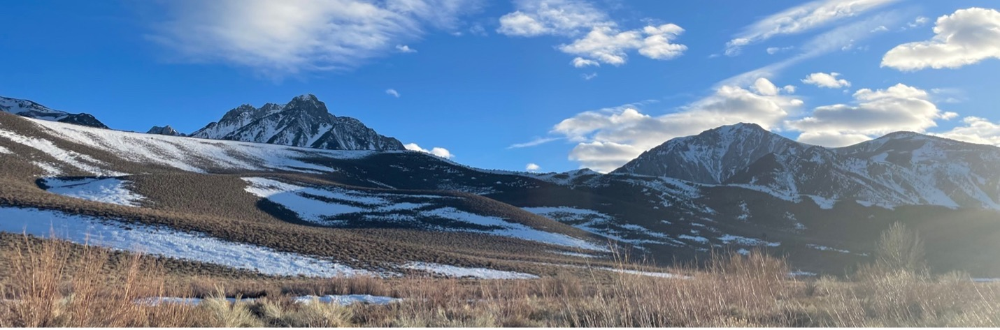
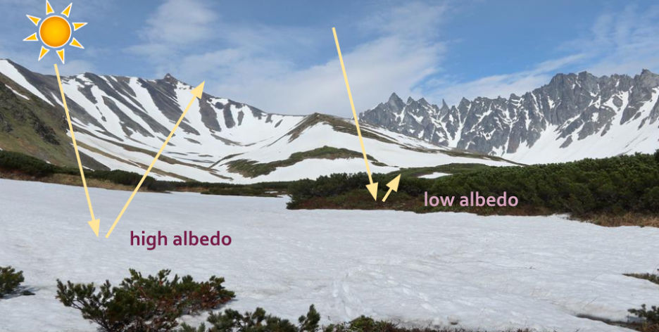

```{r setup, include=FALSE}
knitr::opts_chunk$set(echo = FALSE)
```

For the past 6 months I’ve worked with the [Snow Today capstone group](https://bren.ucsb.edu/projects/improving-usability-snow-data-through-web-based-visualizations-and-tutorials). Our initial goal was to develop web-based visualizations of snow cover and albedo data. We worked with output files from a model called SPIReS (Snow Property Inversion from Remote Sensing) that was developed by researchers with the UCSB Earth Research Institute ([Bair 2021](https://ieeexplore.ieee.org/document/9290428)). SPIReS uses MODIS satellite imagery to estimate snow cover and albedo. MODIS (Moderate Resolution Imaging Spectroradiometer) is a NASA satellite instrument that has collected daily data on Earth’s land, oceans, and atmosphere since the year 2000. MODIS also collects data on the cryosphere, the frozen parts of earth covered by snow and ice. The Snow Today group quickly began brainstorming visualization and website platform strategies, but soon realized we had to take a step back. We had no idea how to even open the datasets. 

The datasets used in the Snow Today project could be improved by incorporating FAIR data principles ([Wilkinson 2016](https://www.nature.com/articles/sdata201618)). FAIR stands for Findable, Accessible, Interoperable, and Reusable. The metadata associated with the snow cover and albedo datasets was hard to find and once it was found, it was hard to interpret. The metadata told us the map projection of the data, but this information wasn’t attached in a standard format that could be recognized by common mapping software and spatial packages. This meant that we couldn’t plot the data on a map in the correct location. This also meant that researchers or water managers faced a significant barrier if trying to use the dataset to learn about their local water supply.

As we worked through the challenges of the snow cover and albedo datasets, our goals shifted towards creating an open-source workflow to make the data more meaningfully open. While the data used for our project is available online for anyone to download (if you know where to find it), insights can be hard or near impossible to gather without specialized training. After many conversations with the dataset creators, we were able to develop a workflow around the metadata challenges. To see the final product of the Snow Today capstone group, including tutorials to guide others through the steps of repeating our workflow, visit our [interactive web app](https://shiny.snow.ucsb.edu/snow_today_shiny_app/)

Quantifying snow cover area is important because much of the world’s population, from the Western US to High Mountain Asia, relies on winter snowpacks for year-round drinking water, but...

### Why do we care about albedo? 

Albedo is a measure of how much solar energy is reflected from a surface. Albedo has important climate implications because it determines how much radiation the planet absorbs. Dark surfaces like soil and vegetation have low albedo values while lighter surfaces such as snow have higher albedo values. Dirty snow absorbs more solar radiation and therefore melts faster than clean snow. Since spring snowmelt contributes to drinking water reservoirs in drier months, earlier snowmelt can leave less water in the summer when it’s needed most. A layer of fresh snow increases albedo for that area, which can result in local cooling. When snow melts, it reveals darker surfaces with lower albedo which increases local temperatures and encourages more melting in a feedback loop where the surface absorbs more solar radiation.


Ash from wildfires, soot from fossil fuels, and dust from mining and agricultural activities such as overgrazing can be transported by wind and deposited on snow, lowering its albedo. A case study found that snow in some areas was cleaner during COVID lockdowns, likely due to decreased emissions from factories and transportation ([Bair 2021](https://www.pnas.org/doi/full/10.1073/pnas.2101174118)). Many studies have shown that communities of color and low-income communities are disproportionately affected by poor air quality and associated health risks ([US EPA 2021](https://www.epa.gov/ej-research/epa-research-environmental-justice-and-air-pollution)). To add to this injustice, drinking water supplies stored in snowpacks are also threatened by air pollution from sources such as factories and highways that reduce albedo and thus trigger localized warming and earlier melting.

Albedo factors into the debate of human responsibility and agency regarding future contributions to and mitigation of climate change. [Coeckelbergh (2020)](https://link.springer.com/article/10.1007/s43681-020-00007-2) discusses the problem of the “Anthropocene” (the current geological age where human activity is a dominant influence on the climate and environment) and asks if increased agency of humans towards Earth processes is a good thing. The term “Anthropocene” was introduced by PJ Crutzen, a Dutch meteorologist and atmospheric chemist [(Crutzen 2006)](https://link.springer.com/chapter/10.1007/3-540-26590-2_3). Interestingly, Crutzen also contributed to the discussion of human measures to cool the planet such as injecting sunlight reflecting aerosol particles into the stratosphere to reflect solar radiation and thereby reduce global albedo [(Lawrence and Crutzen 2017)](https://agupubs.onlinelibrary.wiley.com/doi/full/10.1002/2016EF000463). Future research should emphasize the importance of environmental justice when attempting to balance methods to reduce emissions and technologies to mitigate climate change.

Widespread albedo data is difficult to collect in the field so remote sensing data is required to evaluate the effect of changing albedo on Earth processes. The creators of the SPIReS model plan to expand their work to include not just the Western US, but all of North America, Greenland, and High Mountains Asia. To fully make their datasets accessible to stakeholders and policy makers regardless of scientific or technical training, they will have to improve data documentation and visualization workflows. While this data is not currently used for AI or machine learning applications, there is potential to use these methods to reduce the uncertainty of snow properties in climate models [(Rolnick et al 2019)](https://dl.acm.org/doi/10.1145/3485128). As global temperatures continue to rise and frozen water resources become harder to manage, communicating this valuable dataset to a wider audience will help mitigate the effect of human activities on drinking water supplies and public health.

# References
Bair, Edward, Timbo Stillinger, Karl Rittger, and McKenzie Skiles. “COVID-19 Lockdowns Show Reduced Pollution on Snow and Ice in the Indus River Basin.” Proceedings of the National Academy of Sciences 118, no. 18 (May 4, 2021): e2101174118. https://doi.org/10.1073/pnas.2101174118.

Bair, Edward H., Timbo Stillinger, and Jeff Dozier. “Snow Property Inversion From Remote Sensing (SPIReS): A Generalized Multispectral Unmixing Approach With Examples From MODIS and Landsat 8 OLI.” IEEE Transactions on Geoscience and Remote Sensing 59, no. 9 (September 2021): 7270–84. https://doi.org/10.1109/TGRS.2020.3040328.

Coeckelbergh, Mark. “AI for Climate: Freedom, Justice, and Other Ethical and Political Challenges.” AI and Ethics 1, no. 1 (February 1, 2021): 67–72. https://doi.org/10.1007/s43681-020-00007-2.

Crutzen, Paul J. “The ‘Anthropocene.’” In Earth System Science in the Anthropocene, edited by Eckart Ehlers and Thomas Krafft, 13–18. Berlin, Heidelberg: Springer, 2006. https://doi.org/10.1007/3-540-26590-2_3.

Lawrence, Mark G., and Paul J. Crutzen. “Was Breaking the Taboo on Research on Climate Engineering via Albedo Modification a Moral Hazard, or a Moral Imperative?” Earth’s Future 5, no. 2 (2017): 136–43. https://doi.org/10.1002/2016EF000463.

Rolnick, David, Priya L. Donti, Lynn H. Kaack, Kelly Kochanski, Alexandre Lacoste, Kris Sankaran, Andrew Slavin Ross, et al. “Tackling Climate Change with Machine Learning.” ACM Computing Surveys 55, no. 2 (February 8, 2022): 42:1-42:96. https://doi.org/10.1145/3485128.

Wilkinson, Mark D., Michel Dumontier, IJsbrand Jan Aalbersberg, Gabrielle Appleton, Myles Axton, Arie Baak, Niklas Blomberg, et al. “The FAIR Guiding Principles for Scientific Data Management and Stewardship.” Scientific Data 3, no. 1 (March 15, 2016): 160018. https://doi.org/10.1038/sdata.2016.18.

US EPA, ORD. “EPA Research: Environmental Justice and Air Pollution.” Overviews and Factsheets, September 15, 2021. https://www.epa.gov/ej-research/epa-research-environmental-justice-and-air-pollution.


Distill is a publication format for scientific and technical writing, native to the web.

Learn more about using Distill at <https://rstudio.github.io/distill>.


